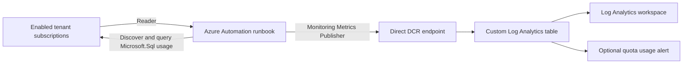

## Overview

This project deploys a daily, credential-free pipeline that collects regional
Azure SQL Managed Instance vCore quota values and writes them to a custom Log
Analytics table.

The solution is based on a verified production pattern. A `kind: Direct` Data
Collection Rule (DCR) exposes its own Logs Ingestion API endpoint, so a separate
Data Collection Endpoint (DCE) is not required for public network ingestion.



## Deployed resources

The subscription-scoped Bicep template creates or configures:

* Resource group
* New Log Analytics workspace with 30-day retention, or a selected existing workspace
* Custom Analytics table for quota records
* Direct Data Collection Rule and transformation
* Azure Automation Account with a system-assigned managed identity
* PowerShell 7.2 runbook shell
* Daily Automation schedule
* Optional Azure Monitor scheduled query alert
* `Reader` assignments on enabled subscriptions accessible during deployment
* `Monitoring Metrics Publisher` on the DCR

The deployment script renders the tenant ID, regions, DCR endpoint, immutable
DCR ID, stream name, and usage counters into a temporary runbook copy. It
publishes those values as Azure Automation parameter defaults and links the
runbook to the schedule. No subscription IDs, resource IDs, endpoints,
credentials, or existing managed identities are embedded in the repository.

## Collected counters

The default configuration collects these regional vCore quota counters:

* `SubscriptionSQLManagedInstanceStandardSeriesVCoreQuota`
* `SubscriptionSQLManagedInstancePremiumSeriesVCoreQuota`
* `SubscriptionSQLManagedInstancePremiumSeriesMemoryOptimizedVCoreQuota`

Each record includes the timestamp, counter name and display name, current
value, limit, unit, region, and source subscription ID.

## Prerequisites

Install or configure:

* PowerShell 7.2 or later
* Azure CLI with Bicep support
* Azure CLI `automation` extension
* An authenticated Azure CLI session
* Permission to create resources and role assignments in the deployment scope
* `Reader` role assignment permission on every enabled subscription in the tenant

```powershell
az login
az extension add --name automation
az bicep install
```

The deployment identity typically needs `Contributor` plus `User Access
Administrator` at the target resource group or subscription. It also needs role
assignment permission on each enabled tenant subscription returned by Azure
CLI. Runtime access is narrower: the Automation Account receives only the two
roles listed above.

## Deploy

Run the deployment script and follow the prompts to select an existing Log
Analytics workspace or create a new one. The script also asks whether to create
a quota usage alert. When enabled, enter a percentage from 1 through 100 and
the `DisplayName` value to monitor:

```powershell
./scripts/Deploy-Solution.ps1 `
    -DeploymentSubscriptionId '00000000-0000-0000-0000-000000000000' `
    -Location 'eastus2' `
    -ResourceGroupName 'rg-sqlmi-quota-monitoring' `
    -TableName 'SqlMiQuota_CL' `
    -DataCollectionRuleName 'dcr-sqlmi-quota-monitoring' `
    -AutomationAccountName 'aa-sqlmi-quota-monitoring' `
    -TenantId '00000000-0000-0000-0000-000000000000' `
    -Regions @('eastus2', 'centralus')
```

Omit `-TenantId` to use the Microsoft Entra tenant associated with the
deployment subscription. The deployer assigns the Automation Account identity
`Reader` on every enabled subscription it can enumerate in that tenant. At run
time, the runbook discovers enabled subscriptions visible to its identity, so
the runbook does not require a subscription array parameter.

For a new workspace, enter its base name. The script appends a hyphen and five
deterministic hexadecimal characters, such as
`law-sqlmi-quota-monitoring-a1b2c`, to reduce naming collisions while ensuring
that redeployments reuse the same workspace. The new workspace is created in
the solution resource group.

For an existing workspace, enter its current name. The script finds it in the
deployment subscription, deploys the custom table there, and places the Data
Collection Rule in the workspace's region. If more than one resource group
contains that name, specify
`-LogAnalyticsWorkspaceResourceGroupName`.

For unattended deployment, provide the choice and name as parameters:

```powershell
# Create a workspace named from the supplied base plus a stable suffix.
./scripts/Deploy-Solution.ps1 `
    -LogAnalyticsWorkspaceMode New `
    -LogAnalyticsWorkspaceName 'law-sqlmi-quota-monitoring' `
    <other parameters>

# Use an existing workspace without changing its name.
./scripts/Deploy-Solution.ps1 `
    -LogAnalyticsWorkspaceMode Existing `
    -LogAnalyticsWorkspaceName 'law-shared-monitoring' `
    -LogAnalyticsWorkspaceResourceGroupName 'rg-shared-monitoring' `
    <other parameters>
```

Provide all three alert parameters to avoid alert prompts during unattended
deployment:

```powershell
./scripts/Deploy-Solution.ps1 `
    -ShouldCreateQuotaAlert $true `
    -QuotaAlertThresholdPercentage 80 `
    -QuotaAlertDisplayName 'VCore quota for Standard Series SQL Managed Instance' `
    <other parameters>
```

The alert evaluates hourly and uses the latest matching record for each
subscription, region, and quota name from the previous two days. It fires when
`CurrentValue / Limit * 100` reaches the configured threshold. The
`DisplayName` match is case-insensitive.

> [!NOTE]
> The deployment creates the Azure Monitor alert rule without an Action Group.
> The fired alert is available in Azure Monitor. Attach an Action Group to the
> rule when email, SMS, webhook, or another notification channel is required.

The schedule starts approximately one hour after deployment and repeats daily
in UTC. Use `-ScheduleStartTime` and `-ScheduleTimeZone` to change that behavior.
The time zone must be an IANA value supported by Azure Automation, such as
`America/New_York`.

Use `-SkipSourceReaderRole` or `-SkipIngestionRole` only when those assignments
are managed separately. The Automation Account identity must have equivalent
permissions before the runbook starts.

The published defaults also allow a manual job to start without re-entering
deployment values. Schedule links contain no duplicate environment parameters;
scheduled jobs inherit the same published defaults.

## Query quota usage

Replace the table name when you choose a different deployment value:

```kusto
SqlMiQuota_CL
| extend UtilizationPercent = iff(Limit > 0, CurrentValue / Limit * 100.0, 0.0)
| summarize arg_max(TimeGenerated, *) by SubscriptionId, Region, Name
| project TimeGenerated, SubscriptionId, Region, DisplayName,
          CurrentValue, Limit, UtilizationPercent
| order by UtilizationPercent desc
```

## Validate changes

Install the local test tools once:

```powershell
Install-Module Pester -MinimumVersion 5.5.0 -Scope CurrentUser
Install-Module PSScriptAnalyzer -Scope CurrentUser
```

Run all checks:

```powershell
npm run validate
```

Validation compiles the Bicep template and sample parameters, runs
PSScriptAnalyzer, and executes the Pester unit tests. GitHub Actions runs the
same command for pushes to `main` and for pull requests.

## Design notes

The Logs Ingestion API supports either a DCE or, for a direct DCR, the endpoint
published on the DCR itself. This project uses the latter. Add a DCE only when
your network design requires private links or another endpoint-specific
configuration; do not attach an unrelated historical DCE.

The runbook requests two managed identity tokens:

* `https://management.azure.com/` for reading Microsoft.Sql usage
* `https://monitor.azure.com/` for posting to the Logs Ingestion API

Transient HTTP responses (`408`, `429`, `500`, `502`, `503`, and `504`) use
bounded exponential retries. Records are posted as JSON arrays, including when
a region returns only one selected counter.

## References

* [Azure Monitor Logs Ingestion API overview](https://learn.microsoft.com/azure/azure-monitor/logs/logs-ingestion-api-overview)
* [Data Collection Rules overview](https://learn.microsoft.com/azure/azure-monitor/data-collection/data-collection-rule-overview)
* [Azure Automation managed identity](https://learn.microsoft.com/azure/automation/enable-managed-identity-for-automation)
* [Azure SQL resource provider usage API](https://learn.microsoft.com/rest/api/sql/usages/list-by-location)